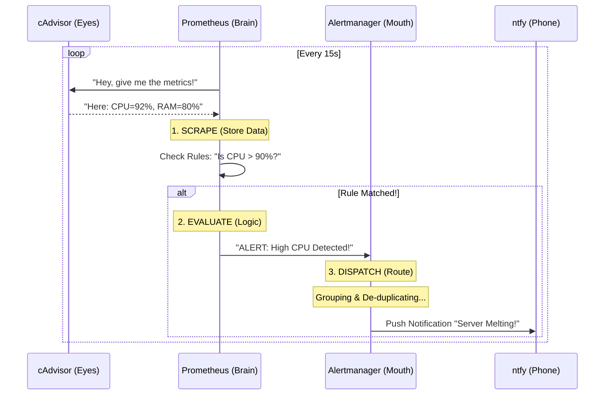
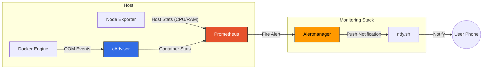
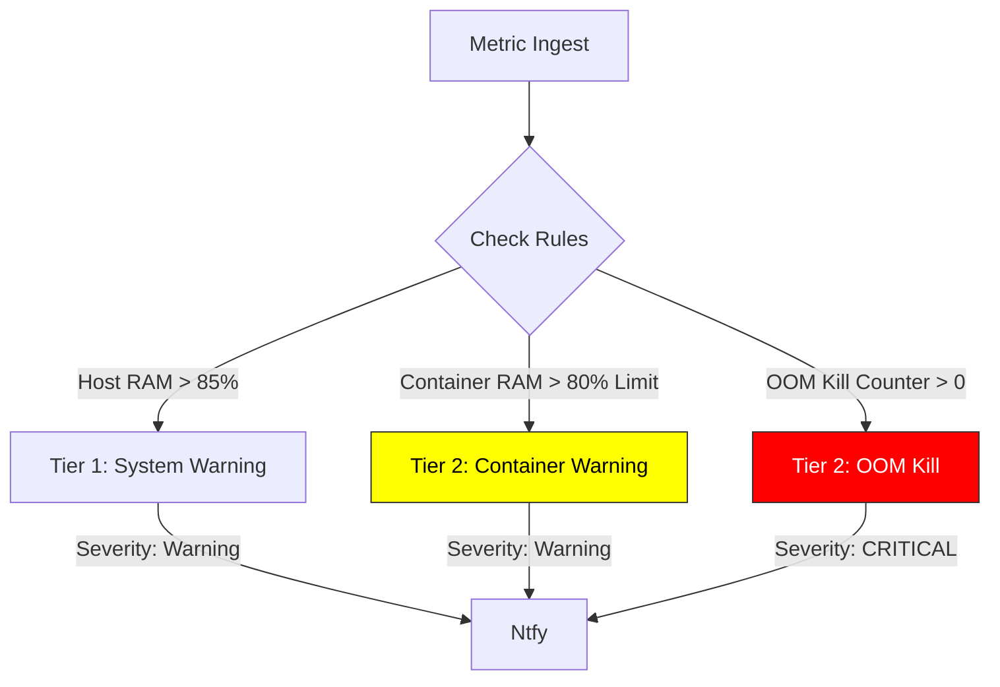

# 🛡️ Lightweight Monitoring Stack (Docker + Prometheus + Ntfy)

> **Core Philosophy:** "Stability First, Dashboards Later."
>
> A reference implementation for monitoring small servers (VPS, Homelabs, Raspberry Pis) where resources are scarce. It prioritizes **direct push notifications** over heavy visualization dashboards.

## The problem: "silent deaths"

On constrained servers (e.g., 4GB-8GB RAM), memory exhaustion (OOM) often manifests as a "silent death":
1.  **The Symptom:** SSH times out, web services hang, but the server ping is still alive.
2.  **The Cause:** The Linux OOM Killer is aggressively sacrificing processes (often your database or web server) to save the kernel.
3.  **The Gap:** Without monitoring, you have no evidence of *what* died or *why*.

Typical monitoring stacks (TIG/TICK) are heavy. Running a Java-based Elasticsearch or a full Grafana instance just to watch memory can be the very thing that kills your server.

## The solution

This stack provides a lightweight "Distress Signal" system using a standard **Prometheus + cAdvisor** pipeline.

### The mechanics: how it actually works

To understand why this stack is stable, you need to understand two concepts: the "census taker" model and the "3-step pipeline."

#### 1. The "census taker" (pull model)
Legacy monitoring systems make your apps shout "I'm alive!" to a server. If the server dies, your apps might hang or crash trying to scream into the void.

Prometheus flips this. It acts like a **census taker**:
-   It holds a list of addresses (targets).
-   It walks around every 15 seconds and politely asks: *"What are your numbers?"*
-   **The benefit:** If Prometheus crashes, your apps (cAdvisor, Node Exporter) keep working silently. **Zero impact on production.**

#### 2. The "supervisor" (cAdvisor)
Your Docker containers (Postgres, Nginx, Python) don't speak "Prometheus" natively. They don't have a `/metrics` page.

**cAdvisor** (Container Advisor) acts as the **supervisor**:
-   It plugs directly into the Docker Engine.
-   It reads raw stats (CPU/RAM) for *every* running container.
-   It publishes a single report that Prometheus reads.
-   *Analogy:* Your containers are silent workers. cAdvisor is the manager who reports their productivity to the census taker.

#### 3. The 3-step pipeline (scrape → eval → dispatch)
We separate the "brain" from the "mouth" to ensure alerts always get through.



Demo how this would look like from the clients (ntfy):

| Demo |
| :--- |
|  |


---

## Architecture

The stack implements this pipeline with minimal resource footprint (~100MB RAM total).



### Components
| Component | Role | Why? |
|-----------|------|------|
| **Prometheus** | Brain | Industry standard "Pull" model. Scrapes targets every 15s. |
| **cAdvisor** | Container Eye | Google's tool. Essential for per-container stats (`container_memory_usage_bytes`). |
| **Node Exporter** | Host Eye | Monitors total host RAM/CPU (system-wide health). |
| **Alertmanager** | Dispatcher | Routes alerts, handles de-duplication and grouping. |
| **ntfy.sh** | Messenger | Delivers push notifications to Android. Zero-setup, reliable cloud tier. |

---

## Alerting logic

We use a "Two-Tier" alerting strategy defined in `prometheus/alerts.yml`.



### Tier 1: System Health (The Canary)
*   **HighMemoryUsage:** Host RAM > 85% for 2m.
    *   *Meaning:* "The whole ship is sinking."
*   **HighCPUUsage:** Host CPU > 90% for 5m.
    *   *Meaning:* "Something is stuck."

### Tier 2: Culprit Identification (The Detective)
*   **ContainerHighMemory:** Container using > 80% of its **hard limit**.
    *   *Meaning:* "Container X is about to crash."
    *   *Condition:* Only fires for containers with a `mem_limit` set.
*   **ContainerOOMKilled:** OOM Kill counter increased.
    *   *Meaning:* "Container X just died."
    *   *Formula:* `increase(container_oom_events_total[1m]) > 0`

---

## Validation & testing (runbook)

**"How do I prove this works?"**

We rely on `polinux/stress-ng` to simulate memory pressure. We use two distinct tests because the *Warning* alert works differently from the *Kill* alert.

### Test 1: The "Yellow Zone" (Warning)
**Goal:** Trigger `ContainerHighMemory` without crashing.

**Concept:** We must set a Docker Limit (`--memory`) for the alert math to work (`usage / limit`). If you run without limits, the alert sees `usage / 0` (or infinite) and never fires.

```bash
# Run a container limited to 200MB, consuming 180MB (90%)
docker run --rm -d \
  --name test-high-mem \
  --memory 200m \
  polinux/stress-ng \
  --vm 1 --vm-bytes 180M --timeout 3m
```

**Expected Outcome:** Alert fires as `WARNING`. Container survives.

### Test 2: The "Red Zone" (OOM Kill)
**Goal:** Trigger `ContainerOOMKilled`.

**Concept:** We force the container to exceed its limit. The Linux kernel (via Docker) will instantly kill it. Prometheus watches the `container_oom_events_total` counter increment.

```bash
# Run a container limited to 100MB, attempting to eat 150MB
docker run --rm -d \
  --name test-oom-kill \
  --memory 100m \
  polinux/stress-ng \
  --vm 1 --vm-bytes 150M --timeout 1m
```

**Expected Outcome:** Container dies immediately. Alert fires as `CRITICAL`.

---

## Configuration snippets

### The "Clean Notification" Hack (prometheus.yml)
To stop ntfy from displaying "Container Author: Przemyslaw Ozgo" and other noise, we drop labels at the source:

```yaml
  - job_name: 'cadvisor'
    # ...
    metric_relabel_configs:
      # Regex matches any label starting with "container_label_"
      - regex: 'container_label_.*'
        action: labeldrop
```

### The "OOM" Rule (alerts.yml)
Notice we filter for `name!=""` to ignore internal Docker pause containers.

```yaml
      - alert: ContainerOOMKilled
        expr: increase(container_oom_events_total{name!=""}[1m]) > 0
        labels:
          severity: critical
        annotations:
          summary: "Container OOM Killed: {{ $labels.name }}"
```
